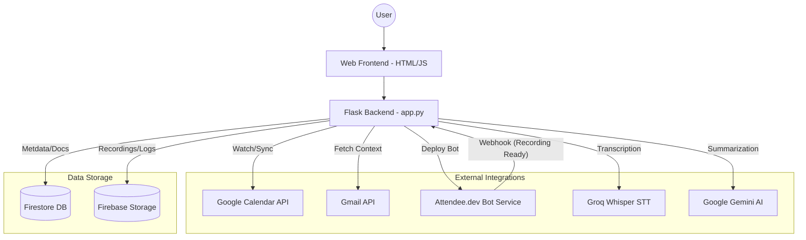
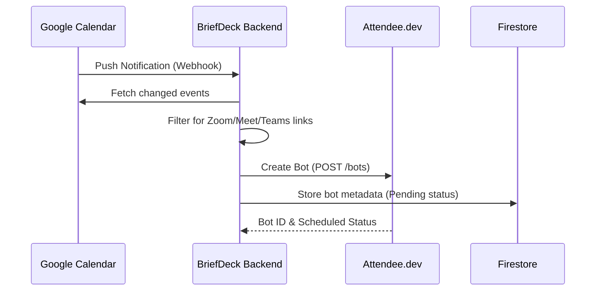
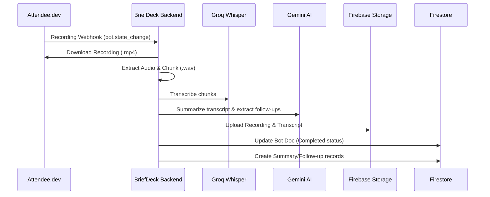

# 🏗️ BriefDeck Architecture & System Design

This document details the system design, architecture, and data flow of the BriefDeck platform.

## 📍 High-Level Overview

BriefDeck is designed as a modular system that orchestrates multiple external services to automate meeting lifecycle management.

---

## 🔄 Core Workflows

### 1. Meeting Detection & Bot Scheduling
BriefDeck monitors the user's Google Calendar via push notifications (webhooks).

### 2. Post-Meeting Processing
Once a meeting ends, the bot service notifies BriefDeck to process the recording.

---

## 📂 Data Model (Firestore)

BriefDeck uses a hierarchical structure in Firestore to manage user data and recordings:

- `users/{user_email}/`
    - `processed_events`: List of calendar event IDs handled.
    - `google_tokens`: OAuth credentials.
    - `Connections/{connection_email}/`
        - `Bots/{bot_id}/` (Main bot metadata)
            - `Recordings/{recording_id}/` (Links to files in GCS)
            - `Summaries/{summary_id}/` (Plain text & structured summaries)
            - `FollowUps/{followup_id}/` (Extracted action items)

---

## 🛠️ Component Breakdown

### 1. Calendar Orchestrator
- **Responsibility**: Maintains Google Calendar watches and sync tokens.
- **Logic**: Filters events based on regex patterns for meeting links (`zoom.us`, `meet.google.com`, `teams.microsoft.com`).
- **File**: `app.py` (functions like `calendar_notify`, `fetch_changed_events_for_user`).

### 2. Bot Manager
- **Responsibility**: Interfaces with `attendee.dev` to deploy and manage recording bots.
- **Logic**: Handles deduplication and scheduling of bots based on meeting start times.
- **File**: `app.py` (`create_bot_for_meeting`).

### 3. Media Processor
- **Responsibility**: Video/Audio manipulation.
- **Logic**: Converts video to audio, chunks audio for Whisper API limits, and manages local temporary storage.
- **Libraries**: `MoviePy`, `PyDub`.
- **File**: `app.py` (`handle_recording`).

### 4. AI Engine
- **Responsibility**: Turning raw audio into structured intelligence.
- **Transcription**: Uses Groq's `whisper-large-v3-turbo` for near-instant transcription.
- **Insights**: Uses Gemini to generate executive summaries, action items, and follow-up emails.
- **File**: `app.py` (`enhance_with_gemini`, `chat_gemini`).

---

## 🔒 Security & Scaling
- **Authentication**: Secured via Firebase Auth and Google OAuth 2.0.
- **Isolation**: All recordings are stored in user-specific folders in Firebase Storage with restricted access.
- **Deployment**: containerized via `Dockerfile` and ready for cloud deployment (e.g., Render, GCP).
